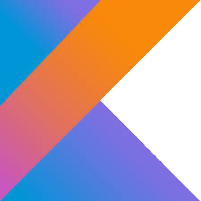

<h1 align="center"> Hi there, I'm Gabriela Ferraz!!! 👋🤗</h1>
<h3 align="center">🚀 | Software Developer | 🚀</h3>

 
  <h3> :woman_technologist: About Me: </h3>

  - 🎓 &nbsp; I'm a Back-End Developer at <a href="">Mercado Livre</a>! 👩‍💻 
  - 💻 &nbsp; I'm specializing in Java architecture and development.
  - 🦆 &nbsp; I'm learning from Gabriel Pato about ethical hacking and technologies to understand how vulnerabilities work and how to identify them in web applications in the <a href="https://sp.pato.academy">Pato Academy</a> course.
  - 🐎 &nbsp; I'm an amazon, equestrian lover.
  - 💃 &nbsp; I'm a belly dancer.
  - 🎶 &nbsp; I love music.
  - ✈  &nbsp; I love to travel, I want to see the world.

 

 

  <h3> 💻 Languages, Technologies and Tools I know and Study: </h3>
  
  
  
  
  
  
  
  
  
  
  
  

 

  <a href="https://github.com/GabiFerraz">
  
  

  ##

 
  
   

  
  
  
 

